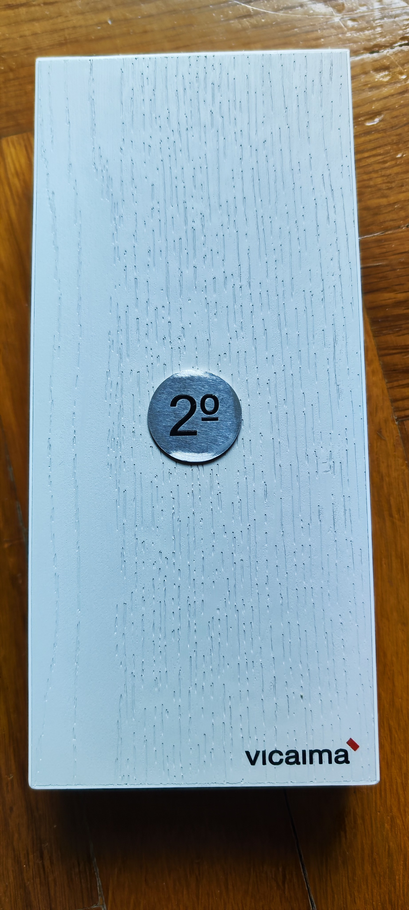

# Hackaton Vicaima

## Objective

Digitization of the evaluation process for the Vicaima universe

## Event Details

From:&nbsp;2024-05-13&nbsp;&nbsp;&nbsp;18:00

Until:&nbsp;&nbsp;2024-05-16&nbsp;&nbsp;&nbsp;12:00

## Team

- Frederico Bajouco
- [Thales Xisto](https://github.com/ThalesXS)
- [João Nunes](https://github.com/joaonunesss)
- [Davi Nunes](https://github.com/davimeireles)

Our team achieved 2nd place.

To see our presentation please visit:

	https://prezi.com/view/oEyYj3dNFCaoIhS1KW1l/

To run our platform please do:

	cd group-2-naaturdor/PDP
	pip install -r requirements.txt
 	python3 manage.py runserver
  
Then visit:

	http://127.0.0.1:8000/
